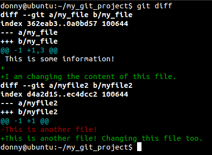
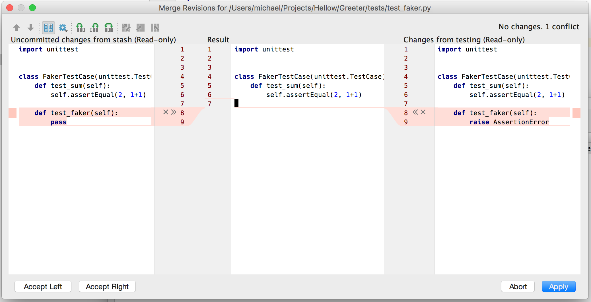
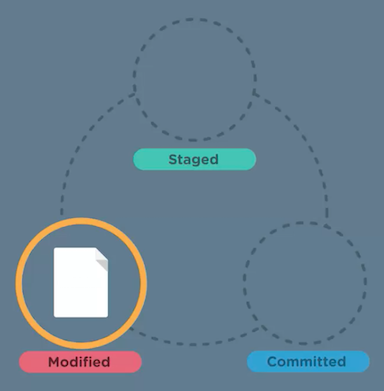
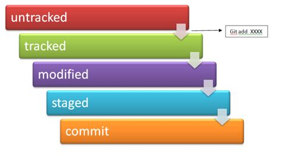

title: Introduction Python et Git

<!-- This slide will serve as the base layout for all your slides -->
<!--
.bottom-bar[
  {{title}}
]
-->

---

# Git - première partie

## Des dépôts de code à partager

---

# Comment gérer du code logiciel ?

## Plusieurs difficultées :

1. **Suivre** le code avec **précision** :

   - Comme on l'a vu **chaque lettre compte** : une erreur = un bug qui peut être grave
   - **Mémoire** : comment savoir ou l'on en était quand on **revient sur le projet d'il y a deux mois**

1. **Collaboration** : Si on travaille à 15 sur un même programme:
   - Comment **partager** nos modifications ?
   - Comment faire si deux personnes travaillent sur le même fichier = **conflits**

---

# Comment gérer du code logiciel ?

3. **Version** du logiciel :
   - Le développement est un travail **itératif** = contruction petit à petit = pleins de versions !
   - On veut ajouter une nouvelle fonctionnalité à un logiciel, mais continuer à distribuer l'ancienne version et l'améliorer.
   - On veut créer une version de test pour que des utilisateurs avancés trouve des bugs

---

# Solution : un gestionnaire de versions

## 1. Suit **chaque modification** faite à des **fichiers textes** (souvent de code mais peut-être autre chose).

---

# Solution : un gestionnaire de versions

## 2. Permet de **stocker plusieurs version** des **même fichiers** et passer d'un version à l'autre.

---

# Solution : un gestionnaire de versions

## 3. Permet suivre **qui** a fait quelle modification, **partager les modifications** avec les autres, **régler les conflits**

---

# Git !

---

# Git !

**git** est un petit programme en ligne de commande. Qui fait tout ce dont on vient de parler:

- Suit les fichiers
- Gère les modifications successives et leurs auteurs
- Fait cohabiter plusieurs versions
- Aide à résoudre les conflits de code

---

# Écosystème git :

## !! à ne pas confondre !!

- **git** : le gestionnaire de version = le coeur de l'écosystème = en ligne de commande
- **les interfaces/GUI de git** : VSCode, tig, meld, gitkraken, etc
  - Pour faciliter l'utilisation de git et visualiser plus facilement
  - communique avec **git** sans le remplacer
- **les forges logicielles** basée sur git comme **github** ou **framagit**:
  - des plateformes web pour accéder au dépot / mettre son code sur les internets.
  - faciliter la collaboration sur un projet
  - tester et déployer le code automatiquement comme dans la démarche DevOps (plus avancé)

On va utiliser **les trois** car c'est nécessaires pour bien comprendre comment on travaille avec git sur un projet.

---

# On va utiliser

- **git** en ligne de commande souvent = il faut absolument connaître les fonctions de base pour travailler sur un projet aujourd'hui
- **VSCode** : un éditeur de texte qui a des fonctions pratiques pour visualiser les modifications git et l'historique d'un projet, afficher les conflits.
- **framagit** : une forge logicielle qui défend le logiciel libre (basée sur gitlab). On va l'utiliser pour collaborer sur le TP de jeux vidéos.

---

# Git, fonctionnement de base

---

# Warning: git est à la fois simple et compliqué.

## Mémoriser les commandes prend du temps :

### Utilisez votre memento !

- On va utilisez les commandes de base durant les prochains jours pour se familiariser avec le **fonctionnement normal**.

- En entreprise on utilise tout le temps git avec une routine simple. On y reviendra.

- Même les ingénieurs avec de l'expérience ne connaissent pas forcément les fonctions avancées.

---

# 1. Créer un nouveau dépôt git, valider une premiere version du code

vous êtes dans un dossier avec du code:

- `git init` créé un dépôt dans ce dossier
- `git add` permet de suivre certains fichier
- `git commit` permet valider vos modifications pour créer ce qu'on appelle un **commit** c'est-à-dire une étape validée du code.
- `git status` et `git log` permettent de suivre l'état du dépôt et la liste des commits.

---

# Le commit

## **to commit** signifier **s'engager**

- **Idéalement**, lorsque vous faite un commit, le code devrait être dans un état à peu près **cohérent**.

## Toujours mettre un **message** de commit

- Les commits sont des étapes du développement du logiciel. Lire la liste de ces étapes devrait permettre à un.e developpeur de comprendre l'évolution du code.

---

# Créer un nouveau dépot : Démonstration !

---

#Git cycle des fichiers

.col-6[]
.col-6[

 
 `git rm fichier` pour désindexer.
  Tracked = suivi
  Staged = inclus (dans le prochain commit)
]

---

# Premier TP

---
