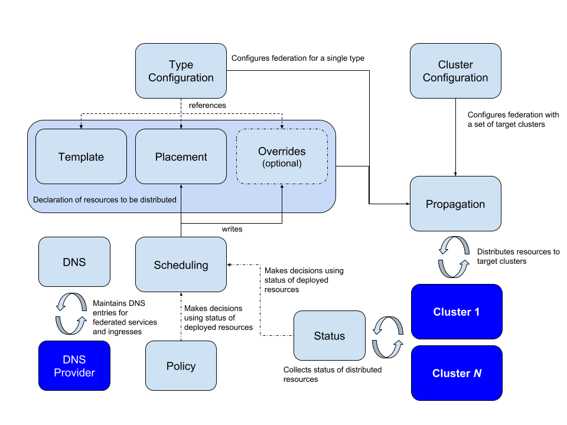

### Namespaces

- Kubernetes a l'originalité de faire tourner ses composants en lui même ~~

### Pods

Un Pod représente un ensemble de conteneurs d'application et de volumes s'exécutant dans le même environnement d'exécution. Les Pods, et non les conteneurs, sont le plus petit artefact déployable dans un cluster Kubernetes. Cela signifie que tous les conteneurs d'un Pod atterrissent toujours sur la même machine.

On dit parfois dans le modèle de Kubernetes qu'un Pod ressemble à une machine virtuelle car les conteneurs à l'intérieur d'un pod peuvent presque s'éxécuter et communiquer comme des processus dans la même machine.

#### "Que dois-je mettre dans un Pod ?"

En voyant un Pod on peut être tenté de se dire "Un conteneur WordPress et un conteneur de base de données MySQL devraient être dans le même Pod."

Cependant c'est un parfait exemple de mauvaise conception de Pod car:
- WordPress et sa base de données ne sont pas vraiment symbiotiques. Si le conteneur de WordPress et le conteneur de la base de données atterrissent sur des machines différentes, ils peuvent quand même travailler ensemble de manière assez efficace, puisqu'ils communiquent par une connexion réseau.
- Deuxièmement, vous ne voulez pas nécessairement scaler WordPress et la base de données ensembles. WordPress est Stateless et peut donc être scalé facilement en réponse à la charge de requête des utilisateurs. Par contre scaler une base de données MySQL est beaucoup plus délicat, et l faudrait plutôt à augmenter les ressources dédiées au Pod MySQL.

#### Lancer un conteneur dans un pod

#### Manifeste de Pod

Conformément au principe descriptif de l'infrastructure as code (voir l'introduction) un pod est décrit à l'aide d'un fichier texte qu'on appelle un manifeste.

#### Health Checks : maintenir en vie les application

Lorsque vous exécutez votre application en tant que conteneur dans Kubernetes, elle est automatiquement maintenue en vie : Un test healthcheck sur le processus du conteneur permet simplement de s'assurer que ce processus principal est toujours en cours d'exécution. Si ce n'est pas le cas, Kubernetes le redémarre.

Cependant un simple contrôle des processus est généralement insuffisant. Par exemple, si votre application est incapable de servir les demandes car le programme est bloqué dans son exécution, un health check sur le processus ne détectera pas le problème (le processus tourne toujours).

Pour remédier à cela on peut définir des healthchecks spécifiques dans le manifeste du Pod pour vérifier que votre application marche correctement: Par exemple on peut charger une page web ou contacter une API pour vérifier que l'application n'est pas seulement toujours en cours d'exécution, mais qu'elle fonctionne.

#### Pod et réseau

Chaque pod a une ip (le kubernetes networking model)

## Architecture de Kubernetes - Les composants de Kubernetes

Control plane
    - kube-proxy
    - controller
    - scheduler
    - cni

Services
    - coredns
    - dashboard

## Architecture de Kubernetes - Le Kubernetes networking model

## Exposer des services depuis un cluster

## Orchestration : gérer les configuration et le cycle de vie des applications

